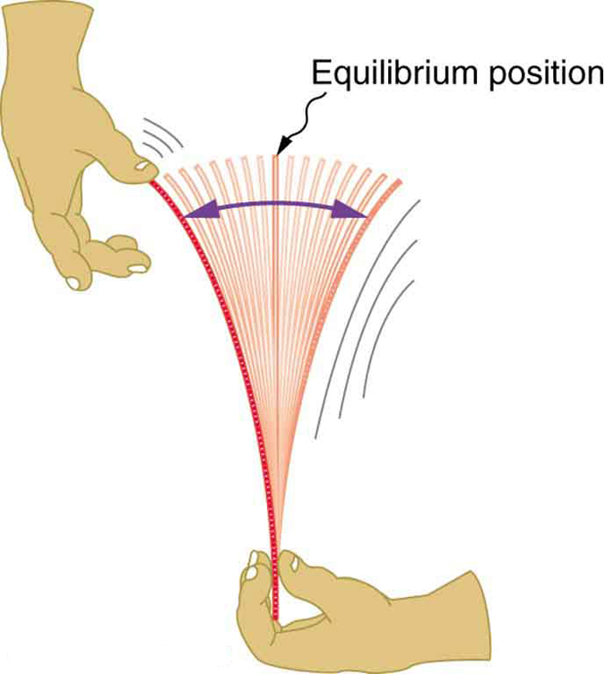

We live in times where we are hooked to our mobile devices more than ever, as if it's an extension of our mind & body. Our interactions with today's mobile screens feel so natural, sometimes magical as if it communicates with us by sensing & responding to the most delicate gestures & the lightest of touches.

Have you ever wondered what goes behind the scenes to give you this fluid experience. We will try to touch & hopefully understand the science behind a very tiny bit of this wholesome magical experience.

### Physics behind Spring Animations

We can appreciate Spring Animation more & more if we understand the science or physics to be precise behind it.

#### Periodic Motion:

- The motion that repeats itself over and over


The time required for one repetition is called as the **Period(T)**. One complete repetition of the motion is called as a Cycle. The number of cycles per unit time is called as the **Frequency(f)**. The relation between frequency & period is:

```
f = 1/T
```

For example, a newborn baby’s heart beats at a frequency of 120 times a minute, its period (the interval between beats) is half a second.

Examples:

- the Earth in its orbit around the Sun
- a water wave
- a bouncing ball

#### Restoring Force:

- A force that tends to bring the system back towards Equilibrium



In the above image, when displaced from its vertical equilibrium position, the plastic ruler oscillates back and forth because of the restoring force opposing displacement. When the ruler is on the left, there is a force to the right, and vice versa.

Examples:

- Bungee Jump
- a swing in motion
- a rocking chair

#### Simple Harmonic Motion:

- a type of Periodic Motion where the Restoring Force is directly proportional to the displacement from Equilibrium


Examples:

- A mass attached to a Spring
- A simple pendulum
- Bungee jump

We are more interested particularly on the first example for our Spring Animation in iOS.  
These pre-conceived perception of physical behavior in nature makes our interaction with mobile device feel more natural along with few other aspects of our own behavior and the ability to act combined with thoughts which we will discuss on the next part of this series.

Stay Tuned...  
Happy Coding
